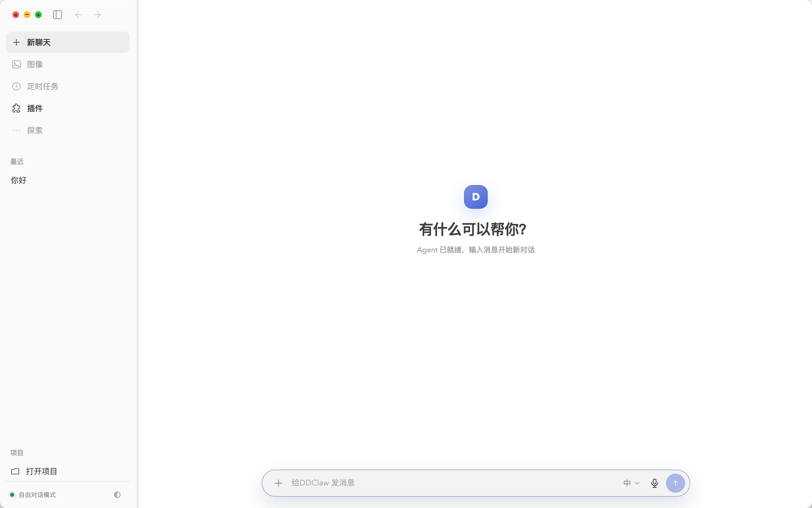
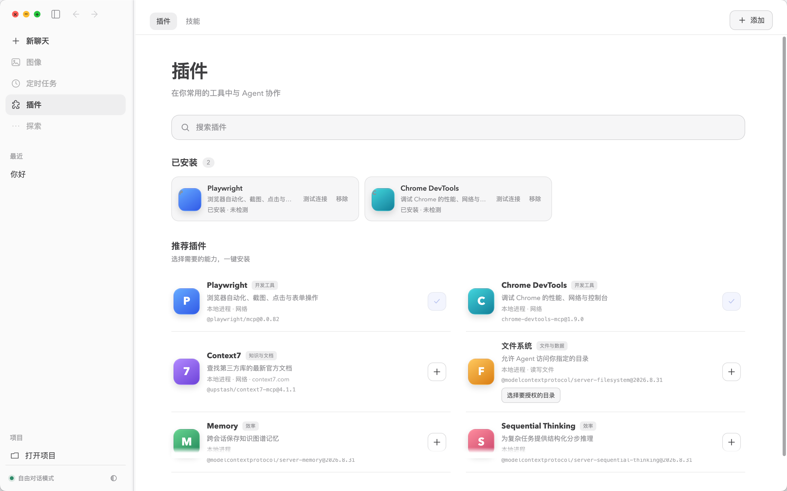

<p align="center">
  
</p>

<h1 align="center">DDClaw</h1>

<p align="center">
  面向日常工作与开发任务的本地桌面 AI Agent
</p>

<p align="center">
  对话、项目、Skills 与 MCP 插件集中在一个简洁的桌面工作区中。
</p>

## 产品展示

### 对话工作区



### 插件中心



## 核心功能

- **桌面对话**：流式回复、停止生成、本地会话记录与快速新建对话。
- **项目模式**：选择并信任本地项目后，让 Agent 在明确的项目范围内工作。
- **文件附件**：支持文本和图片附件，并限制单次数量与文件大小。
- **MCP 插件中心**：在应用内安装、移除和手动测试 MCP 插件，展示插件所需权限。
- **内置插件目录**：提供 Playwright、Chrome DevTools、Context7、文件系统、Memory 和 Sequential Thinking。
- **Skills 管理**：统一查看个人、项目和临时 Skills，支持刷新与诊断提示。
- **会话管理**：支持重命名、置顶、归档和删除。
- **跨平台桌面端**：支持 macOS Apple Silicon 和 Windows x64。

## 工作方式

```text
React 桌面界面
      │ Electron IPC
      ▼
Electron 主进程
      │ JSON-RPC
      ▼
Pi Coding Agent ─── MCP 插件 / Skills / 项目工具
      │
      ▼
DeepSeek
```

渲染进程不直接访问 Node.js。文件、项目、会话和插件操作都通过 preload 中定义的有限 IPC 接口交给主进程处理。

## 环境要求

- Node.js `>= 22.19.0`
- npm
- DeepSeek API Key：通过 `DEEPSEEK_API_KEY` 环境变量提供
- macOS 产物：Apple Silicon
- Windows 产物：Windows 10/11 x64

## 本地开发

```bash
npm install --ignore-scripts
npm run build --workspace=@earendil-works/pi-coding-agent
npm run desktop:dev
```

macOS 或 Linux：

```bash
export DEEPSEEK_API_KEY="你的 API Key"
```

Windows PowerShell：

```powershell
$env:DEEPSEEK_API_KEY="你的 API Key"
```

## 打包桌面应用

### macOS Apple Silicon

```bash
npm run desktop:package:mac
```

生成文件：

- `apps/desktop/release/DDClaw-<version>-arm64.dmg`
- `apps/desktop/release/DDClaw-<version>-arm64-mac.zip`

### Windows x64

```bash
npm run desktop:package:win
```

生成文件：

- `apps/desktop/release/DDClaw Setup <version>.exe`
- `apps/desktop/release/DDClaw-<version>-win.zip`

Windows 包可以在 macOS 上交叉构建，但正式发布前仍应在真实 Windows 10/11 环境验证安装、启动、MCP 插件和卸载流程。

## 配置目录

默认的 Agent 数据目录是 `~/.pi/agent`：

| 内容 | 路径 |
| --- | --- |
| MCP 配置 | `~/.pi/agent/mcp-servers.json` |
| 个人 Skills | `~/.pi/agent/skills/` |

可以通过 `PI_CODING_AGENT_DIR` 修改 Agent 数据目录。

## 验证

```bash
npm run check
```

打包命令会继续执行对应平台的烟测：

- macOS：启动打包后的应用，确认 Agent 能启动并在应用退出后正确清理。
- Windows：检查 PE x64 架构、安装器、ZIP 和运行时资源是否完整。

## 安全边界

- 项目目录必须由用户选择并确认信任。
- 本地进程类插件会在安装前展示权限说明。
- MCP 插件只在用户主动操作时测试，不在页面加载时自动启动。
- MCP 配置使用临时文件和原子替换写入，并保留最近一次有效备份。
- DDClaw 与 Pi 默认使用当前系统用户的文件、进程和网络权限；需要更强隔离时，应在容器或受控系统账户中运行。

## 发布状态

当前 macOS 和 Windows 产物可以用于本地测试。公开分发前还需要配置可信的 Apple Developer ID、Apple 公证和 Windows 代码签名证书，否则系统可能显示 Gatekeeper 或 SmartScreen 警告。

## 项目结构

| 目录 | 说明 |
| --- | --- |
| `apps/desktop` | DDClaw Electron 桌面应用 |
| `packages/coding-agent` | Agent CLI、RPC 模式、Skills 与扩展加载 |
| `packages/agent` | Agent 运行时与工具调用 |
| `packages/ai` | 模型与 Provider 适配 |
| `packages/tui` | 终端界面组件 |

DDClaw 基于 [Pi Agent Harness](https://pi.dev) 构建。贡献规范见 [CONTRIBUTING.md](CONTRIBUTING.md)，开发约束见 [AGENTS.md](AGENTS.md)。

## License

MIT
